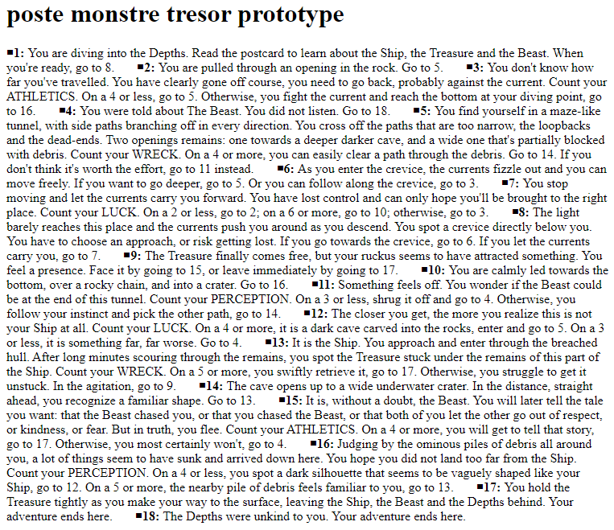

# Poste-Monstre-Trésor Story Format for Twine 2

This is a custom Twine 2 format that renders a story as a printable, linear block of text.

## Building

`node index.js` will build a "format.js" file in the `dist` folder. This can then be loaded in Twine 2 or used with Twee tools.

## Loading in Twine 2

In Twine 2, click on Story Formats. Go to the 'Add a New Format' tab. Copy and paste the following URL and then click '+Add':
`https://ker0chan.github.io/poste-monstre-tresor-story-format/dist/format.js`

## Example

An example story is included in the `demo` folder, and should look like this:

## References

This format was created by using this guide: https://videlais.com/2020/02/28/creating-your-own-twine-2-story-format-part-1-understanding-twine-2-html-structures/
This repository structure and build scripts were copied from: https://github.com/videlais/example-story-format

